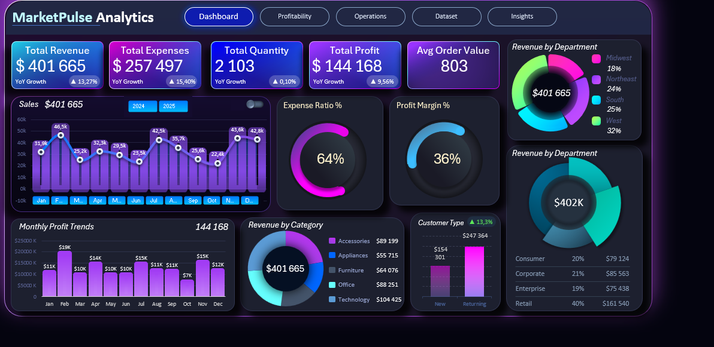
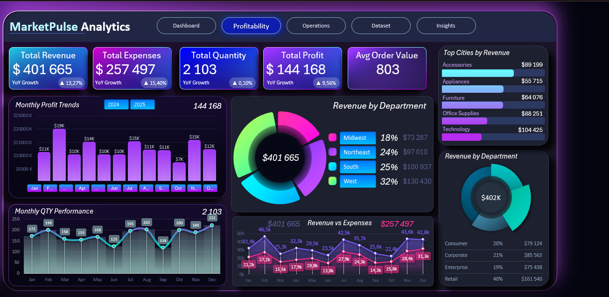
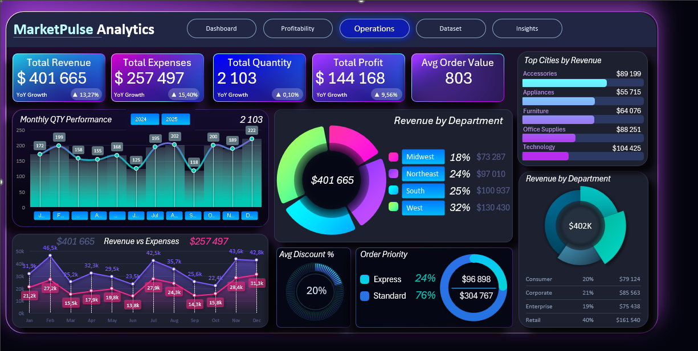

# 📊 MarketPulse Analytics Dashboard

> **Tableau de bord décisionnel interactif** pour l'analyse des performances commerciales, de la rentabilité, des dépenses, du comportement client et des tendances opérationnelles.

---

## 🎯 Objectif du Projet

**MarketPulse Analytics** transforme des données de ventes brutes en insights métier actionnables. Ce tableau de bord aide les parties prenantes à comprendre les moteurs de revenus, les tendances de rentabilité, les segments clients et les axes d'amélioration.

### Ce projet permet de :

- 📌 Surveiller le chiffre d'affaires, les dépenses, le bénéfice et les quantités vendues
- 📈 Analyser les tendances mensuelles des ventes et de la rentabilité
- 🗺️ Évaluer les performances commerciales par région
- 🏆 Identifier les catégories de produits les plus performantes
- 👥 Comprendre la contribution des différents types de clients
- 🔍 Analyser les ratios de dépenses et les marges bénéficiaires
- 🔄 Comparer les performances des nouveaux clients vs. les clients fidèles
- 💡 Identifier des opportunités de croissance du chiffre d'affaires et d'amélioration de la rentabilité

---

## 📌 Indicateurs Clés de Performance (KPIs)

| Indicateur | Valeur |
|---|---|
| 💰 Chiffre d'affaires total | **401 700 $** |
| 💸 Dépenses totales | **257 500 $** |
| 📦 Quantité totale vendue | **2 103 unités** |
| 📈 Bénéfice total | **144 200 $** |
| 🧾 Valeur moyenne des commandes | **803 $** |
| 📊 Marge bénéficiaire | **36 %** |
| 💵 Ratio de dépenses | **64 %** |

---

## 🔍 Insights Clés

### 💰 Revenus & Rentabilité
L'entreprise a généré environ **401 700 $** de chiffre d'affaires pour un bénéfice net de **144 200 $**, soit une marge bénéficiaire saine de **36 %**.

### 📅 Performances Mensuelles
Le chiffre d'affaires mensuel présente des variations tout au long de l'année :
- 🔝 **Février** : meilleur mois avec environ **46 500 $** de revenus
- 📉 **Octobre** : mois le plus faible avec environ **22 400 $**, représentant une opportunité d'amélioration commerciale

### 🗺️ Performances Régionales

| Région | Part du chiffre d'affaires |
|---|---|
| 🥇 Ouest (West) | **32 %** |
| 🥈 Sud (South) | **25 %** |
| 🥉 Nord-Est (Northeast) | **24 %** |
| 4️⃣ Midwest | **18 %** |

### 🏷️ Performances par Catégorie de Produits

| Catégorie | Chiffre d'affaires |
|---|---|
| 🖥️ Technologie | ~104 400 $ |
| 🎧 Accessoires | ~89 200 $ |
| 🗂️ Bureautique | ~88 300 $ |

### 👥 Performances Clients
- **Clients fidèles (Returning)** : ~247 400 $ — largement en tête, preuve d'une excellente rétention client
- **Nouveaux clients (New)** : ~154 300 $

### 🏢 Types de Clients

| Type de client | Part du CA |
|---|---|
| 🛒 Retail (Commerce de détail) | **40 %** (~161 500 $) |
| 🏢 Corporate (Entreprises) | — |
| 👤 Consumer (Particuliers) | — |
| 🏭 Enterprise (Grandes entreprises) | — |

---

## 📊 Aperçu du Tableau de Bord

Le projet comprend **3 pages** de tableau de bord :

| Page | Titre | Description |
|---|---|---|
| 📄 Page 1 | **Dashboard** | Vue d'ensemble exécutive |
| 📄 Page 2 | **Profitabilité** | Analyse de la rentabilité |
| 📄 Page 3 | **Opérations** | Analyse clients & opérationnelle |

### 🖥️ Page I — Dashboard Principal

### 💹 Page II — Analyse de la Profitabilité

### ⚙️ Page III — Opérations & Clients

---

## 📁 Fichiers du Projet

| Fichier | Description |
|---|---|
| 📄 `Dataset.csv` | Jeu de données brut utilisé pour l'analyse |
| 📊 `MarketPulse Analytics.xlsx` | Classeur Excel contenant l'analyse et le tableau de bord |
| 🖼️ `Page1.png` | Capture d'écran — Dashboard principal |
| 🖼️ `Page2.png` | Capture d'écran — Analyse de profitabilité |
| 🖼️ `Page3.png` | Capture d'écran — Opérations & clients |

---

## 🛠️ Outils & Technologies

- **Microsoft Excel** — Outil principal d'analyse et de visualisation
- **Power Query** — Transformation et nettoyage des données
- **Power Pivot** — Modélisation des données et calculs avancés
- **Tableaux & Graphiques Croisés Dynamiques** — Analyse multidimensionnelle
- **Formules Excel** — Calculs personnalisés et KPIs
- **Visualisation de données** — Graphiques interactifs et mise en forme conditionnelle
- **Business Intelligence & Analytics** — Démarche analytique orientée décision

---

## 📈 Fonctionnalités du Tableau de Bord

### 🖥️ Dashboard Exécutif (Page 1)
Vue d'ensemble stratégique comprenant :
- Chiffre d'affaires, dépenses, bénéfice et quantités vendues
- Valeur moyenne des commandes (AOV)
- Tendances mensuelles du chiffre d'affaires
- Performances par client et par région
- Performances par catégorie de produits

### 💹 Analyse de la Profitabilité (Page 2)
Analyse approfondie focalisée sur :
- Évolution des bénéfices dans le temps
- Marges bénéficiaires par catégorie et par région
- Ratios de dépenses
- Comparaison Revenus vs. Dépenses
- Profitabilité par catégorie et par zone géographique

### ⚙️ Opérations & Analyse Clients (Page 3)
Insights opérationnels incluant :
- Segmentation des clients (Retail, Corporate, Consumer, Enterprise)
- Comparaison Nouveaux clients vs. Clients fidèles
- Performance des livraisons
- Volume des ventes et tendances produits
- Performance par catégorie et tendances opérationnelles

---

## 💡 Valeur Métier

**MarketPulse Analytics** permet aux décideurs d'identifier rapidement :

✅ Les régions et catégories les plus performantes
✅ Les opportunités de croissance du chiffre d'affaires
✅ Les schémas de coûts et de dépenses
✅ La performance de fidélisation client
✅ Les périodes de sous-performance commerciale
✅ Les principaux leviers de rentabilité

En combinant ces insights, les entreprises peuvent prendre des **décisions basées sur les données**, améliorer leur efficacité opérationnelle, renforcer la fidélisation client et augmenter leur rentabilité globale.

---

## 👤 Auteur

**Muhammad Jan**
*Data Analyst | Business Intelligence | Excel | Power BI | SQL | Python*

---

  <i>Développé avec ❤️ pour transformer les données en décisions intelligentes.</i>

